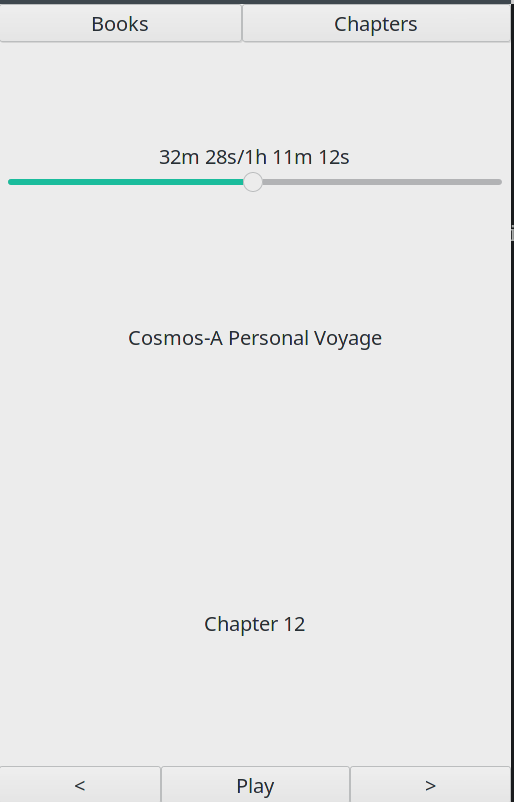
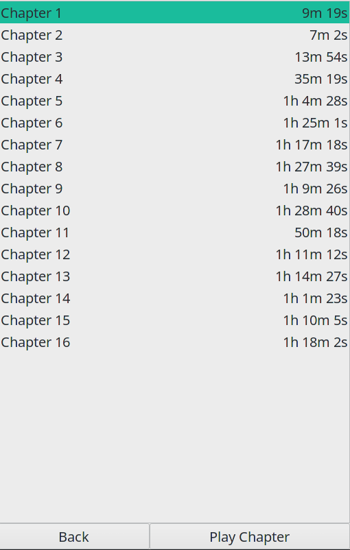

# абоба

Mobile friendly audio book player.
Runs on linux using GTK3 and GStreamer.

 

## Build

1. [Install rust](https://www.rust-lang.org/tools/install)

2. Install dependencies  
    `gstreamer` and `gtk 3`
3. `cargo build`

## Roadmap

- [ ] Basic functionality  
    - [x] Play audio files
    - [x] Seeking
    - [x] Position saving
    - [x] Reading chapters info (m4a, m4b and 3gp)
    - [ ] Audio book library
    - [x] Prevent device from sleeping while playing
- [ ] Better UX
    - [ ] Improve user interface
    - [ ] Playback speed
    - [ ] Settings
